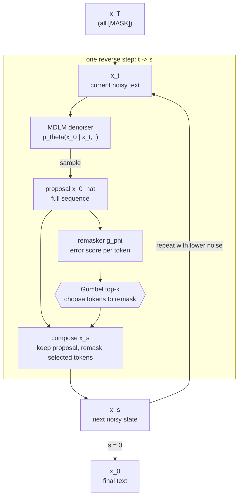

# Guided Star-Shaped Masked Diffusion

Reference implementation of **Guided Star-Shaped Masked Diffusion** (G-Star), a sampler for pretrained masked diffusion language models. The current paper version is [arXiv:2510.08369](https://arxiv.org/abs/2510.08369), published at the ReALM-GEN Workshop, ICLR 2026.

This repository forks [`kuleshov-group/mdlm`](https://github.com/kuleshov-group/mdlm) and keeps the MDLM training/evaluation stack while adding:

- a guided star-shaped sampler that can revise already generated tokens;
- a learned remasker `g_phi` that predicts likely token errors;
- ReMDM, confidence-star, and P2 sampling baselines;
- sampling metrics and optional trajectory logging for debugging refinement behavior.

## Core Idea

Masked diffusion language models denoise text by repeatedly predicting `p_theta(x_0 | x_t)` and replacing `[MASK]` tokens. Standard MDLM sampling is monotone: after a token is revealed, it is copied forward and never reconsidered. This is efficient, but it makes early mistakes irreversible.

G-Star changes the reverse step into a revise-and-refine loop:

1. Predict a full clean proposal `x_0_hat ~ p_theta(x_0 | x_t)`.
2. Score each proposal position with a lightweight error predictor `g_phi`.
3. Remask the positions most likely to be wrong.
4. Let the denoiser fill those positions again at the next step.



A single guided star-shaped update is implemented in `samplers/remasker.py`:

1. Compute `p_x0 = p_theta(x_0 | x_t, t)`.
2. Sample proposal tokens from `p_x0`; already revealed tokens are kept in the proposal.
3. Run `g_phi(x_0_hat)` to get one error logit per position.
4. Add Gumbel noise, scale by `sampling.remasker_temperature`, and select `ceil(alpha_s * L)` positions.
5. Replace the selected positions with `[MASK]` to form the next state.

The remasker is trained separately against a frozen denoiser. For each clean sequence `x_0`, the code samples a diffusion time `t`, creates `x_t`, takes one DDPM denoising step to get `x_s`, and trains `g_phi` to identify positions where `x_s != x_0`.

## Repository Map

```
mdlm-fork/
├── main.py                    # train the denoiser / run sample_eval / ppl_eval
├── remasker_train.py          # train g_phi against a frozen denoiser
├── diffusion.py               # LightningModule, losses, checkpoint loading, sampler dispatch
├── samplers/
│   ├── remasker.py            # guided star-shaped update
│   ├── conf_star_shape.py     # confidence-guided star-shaped ablation
│   └── p2.py                  # Path-Planning baseline
├── models/
│   ├── dit.py                 # Diffusion Transformer backbone
│   ├── dimamba.py             # optional DiMamba backbone
│   ├── autoregressive.py      # AR baseline
│   ├── remasker.py            # RemaskerNet: DIT + single-logit head
│   └── ema.py
├── configs/                   # Hydra configs
├── scripts/
│   ├── train/                 # denoiser and remasker training scripts
│   ├── sample/                # sampling and evaluation scripts
│   └── demo/                  # small demos
├── docs/                      # method notes
├── notebooks/                 # sample and trajectory inspection
├── noise_schedule.py          # loglinear, loop, geometric, cosine, linear
├── dataloader.py              # tokenization and datasets
├── requirements.txt
└── CITATION.cff
```

## Installation

This code is intended for CUDA GPUs. The DIT backbone depends on `flash-attn`, so install PyTorch for your CUDA version before installing the rest of the requirements.

```bash
conda create -n mdlm python=3.10 -y
conda activate mdlm
pip install -r requirements.txt
```

Optional DiMamba dependencies:

```bash
pip install mamba-ssm causal-conv1d
```

Main dependencies:

- Python 3.10
- PyTorch 2.3+
- CUDA 12.x
- `flash-attn`
- PyTorch Lightning
- Hydra
- Weights & Biases for experiment logging

## Quickstart

The scripts under `scripts/` are the recommended entry points. They are normal shell scripts, so you can override their environment variables without editing the files.

### 1. Train The MDLM Denoiser

```bash
export WANDB_API_KEY=...
export CKPT_DIR=./checkpoints
bash scripts/train/train_mdlm.sh
```

This trains the `configs/model/small.yaml` DIT denoiser on OpenWebText with sequence length 512. The main checkpoint is written under:

```bash
${CKPT_DIR}/mdlm-owt-seqlen512-<timestamp>/checkpoints/last.ckpt
```

### 2. Train The Remasker

```bash
export WANDB_API_KEY=...
export CKPT_DIR=./checkpoints
export DENOISER_CKPT=${CKPT_DIR}/mdlm-owt-seqlen512-<timestamp>/checkpoints/last.ckpt
bash scripts/train/train_remasker.sh
```

The remasker initializes from the denoiser backbone and trains the error-prediction head against frozen denoiser mistakes. Checkpoints are saved through Lightning under `checkpoints/`; `remasker_train.py` also writes a convenience copy to `checkpoints_remasker/last.ckpt`.

Alternative remasker training scripts:

| Script | Target |
| --- | --- |
| `scripts/train/train_remasker.sh` | Default BCE target: `x_s != x_0`. |
| `scripts/train/train_remasker_ranknet.sh` | [RankNet pairwise ranking loss](docs/ranknet_remasker_loss.md), configured for 4 GPUs. |
| `scripts/train/train_remasker_random_corruption.sh` | Detect uniformly corrupted tokens. |
| `scripts/train/train_remasker_ar_perplexity.sh` | Detect tokens with high frozen-GPT-2 per-token NLL. |

### 3. Sample With G-Star

```bash
export DENOISER_CKPT=${CKPT_DIR}/mdlm-owt-seqlen512-<timestamp>/checkpoints/last.ckpt
export REMASKER_CKPT=${CKPT_DIR}/remasker-seqlen512-<timestamp>/checkpoints/last.ckpt
export SEQLEN=512
export STEPS=128
bash scripts/sample/sample_star_shape.sh
```

`sample_star_shape.sh` uses the paper-style sampler: plain DDPM at high noise, then guided star-shaped refinement once the reverse-time trajectory reaches `sampling.t_on` under the loglinear schedule.

## Sampling Modes

Sampling is selected with `sampling.predictor` in `configs/config.yaml` or by Hydra overrides.

| `sampling.predictor` | Meaning |
| --- | --- |
| `ddpm` | Standard MDLM DDPM update. |
| `ddpm_cache` | Standard MDLM DDPM update with probability caching when possible. |
| `analytic` | Closed-form analytic update used for SEDD-style baselines. |
| `star_shape` | Paper path: DDPM first, then guided star-shaped refinement under loglinear noise. |
| `remasker` | Guided remasker update gated by `[sampling.remasker_t_off, sampling.remasker_t_on]`; the provided script uses the `loop` noise schedule. |
| `conf_star_shape` | Ablation that uses denoiser confidence instead of a learned remasker. |
| `p2` | Path-Planning baseline with full-sequence proposal resampling and confidence top-k. |

Baseline scripts:

| Script | Sampler |
| --- | --- |
| `scripts/sample/sample_mdlm.sh` | Pure MDLM (`ddpm_cache`). |
| `scripts/sample/sample_remdm.sh` | ReMDM via `sampling.remdm_mode=cap`. |
| `scripts/sample/sample_p2.sh` | P2 baseline. |
| `scripts/sample/sample_remasker.sh` | Remasker-guided loop-schedule variant. |
| `scripts/sample/eval_ppl.sh` | Zero-shot validation perplexity. |

Key sampling knobs:

| Config | Effect |
| --- | --- |
| `sampling.steps` | Number of reverse diffusion steps. |
| `sampling.nucleus_p` | Optional top-p filtering on `p_x0`. |
| `sampling.denoiser_temp_during_remasking` | Temperature for denoiser proposal sampling during remasking. |
| `sampling.remasker_temperature` | Temperature for remasker logits before Gumbel-top-k. |
| `sampling.remasker_checkpoint_path` | Required when using `star_shape` or `remasker`. |
| `sampling.t_on` | Start time for `star_shape` refinement, supplied by the sampling scripts as a Hydra override; lower values mean later/shorter refinement. |
| `sampling.remasker_t_off`, `sampling.remasker_t_on` | Active remasker window for `sampling.predictor=remasker`. |
| `sampling.remdm_mode` | ReMDM variants: `null`, `cap`, `rescale`, `conf`, `loop`. |

## Remasker Training Options

Remasker label generation is controlled by `remasker.training_strategy`.

| Strategy | Labels |
| --- | --- |
| `default` | Token disagreement between one DDPM denoising step `x_s` and ground truth `x_0`. |
| `random_corruption` | Positions randomly corrupted in `x_0`; no diffusion pipeline is used. |
| `ar_perplexity` | Positions whose per-token NLL under a frozen AR model exceeds `remasker.ar_nll_threshold`. |

Loss and data-shaping options:

| Config | Effect |
| --- | --- |
| `training.remasker_reweighting` | Reweight BCE so positive/negative classes contribute equally. |
| `training.remasker_use_ranknet_pairwise_loss` | Use RankNet ranking loss instead of BCE. |
| `training.remasker_loss_only_new_tokens` | Compute loss only on positions newly generated between `x_t` and `x_s`. |
| `sampling.t_sampling` | Sample training time uniformly or use `sampling.t_const`. |
| `sampling.uniform_ratio` | Replace a fraction of tokens with uniform random vocab samples. |
| `sampling.prior_ratio` | Replace a fraction with samples from the sequence token-frequency prior. |
| `sampling.semantic_change_ratio` | Swap tokens with nearest-neighbor embedding samples. |
| `sampling.interval_shuffle_ratio` | Shuffle local token intervals. |

See [RankNet Remasker Loss](docs/ranknet_remasker_loss.md) for the motivation and formula behind `training.remasker_use_ranknet_pairwise_loss`.

## Evaluation Outputs

`mode=sample_eval` writes generated and reference samples, computes generative perplexity, MAUVE when installed, and n-gram diversity metrics.

Useful output locations:

| Output | Location |
| --- | --- |
| Generated text | `generated_samples/` inside the Hydra run directory. |
| Validation text | `validation_samples/` inside the Hydra run directory. |
| Metrics JSONL | `metrics.jsonl` by default, or `+eval.metrics_file=/path/to/file.jsonl`. |
| Sampling trajectories | `sampling_trajectories/` when `eval.save_sampling_trajectory=true`. |
| Hydra config snapshot | `config_tree.txt` in `checkpointing.save_dir`. |

Because Hydra is configured with `hydra.job.chdir=true`, relative output paths are usually created inside the current Hydra run or multirun directory.

## Practical Notes

- Match the denoiser, remasker, tokenizer, and intended sequence length when comparing samplers.
- `star_shape` and `remasker` require a valid `sampling.remasker_checkpoint_path`; an empty path will raise at model load time.
- Early remasking can destabilize samples because the sequence has too little context. Tune `sampling.t_on` or `[sampling.remasker_t_off, sampling.remasker_t_on]` for each setup.
- Lower `sampling.remasker_temperature` makes the remasker more deterministic; very low values can over-trust imperfect error scores.
- Higher `sampling.denoiser_temp_during_remasking` increases proposal diversity; the remasker must then filter more aggressively.

## Citation

If you use this code, please cite G-Star.

```bibtex
@article{meshchaninov2025guided,
  title   = {Guided Star-Shaped Masked Diffusion},
  author  = {Meshchaninov, Viacheslav and Shibaev, Egor and Makoian, Artem and Klimov, Ivan and Balagansky, Nikita and Gavrilov, Daniil and Alanov, Aibek and Vetrov, Dmitry},
  journal = {arXiv preprint arXiv:2510.08369},
  year    = {2025},
}
```

## License

MIT, same as the upstream MDLM repository. See `LICENSE`.
